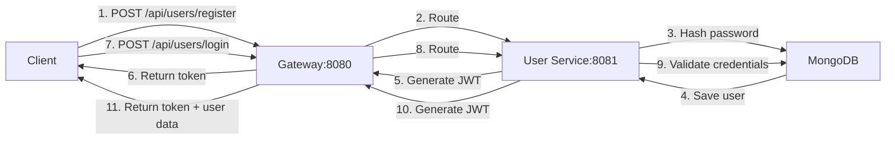
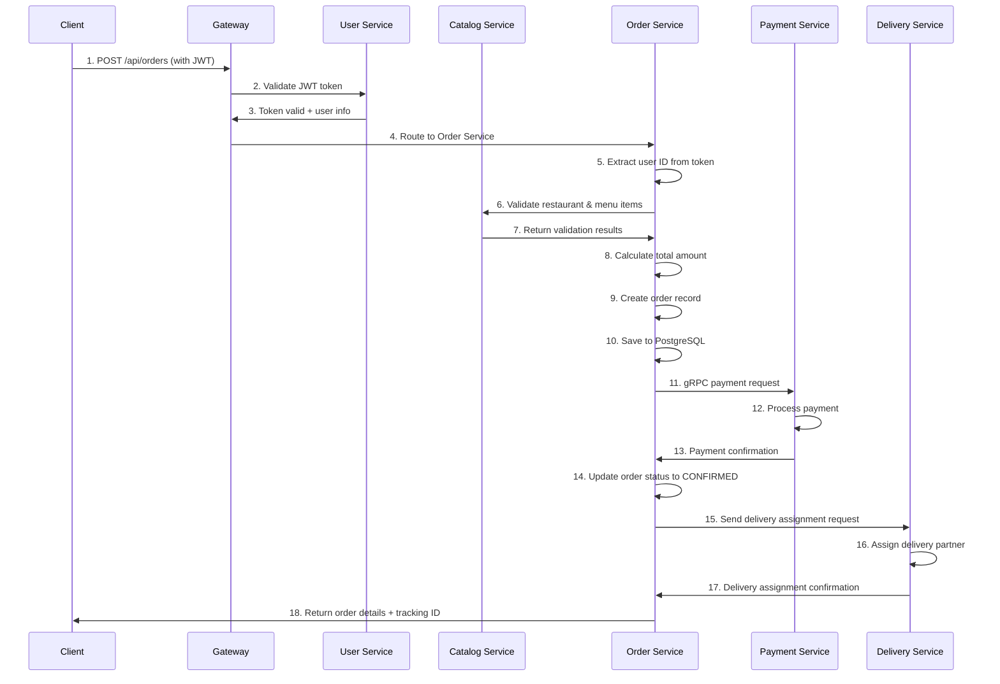
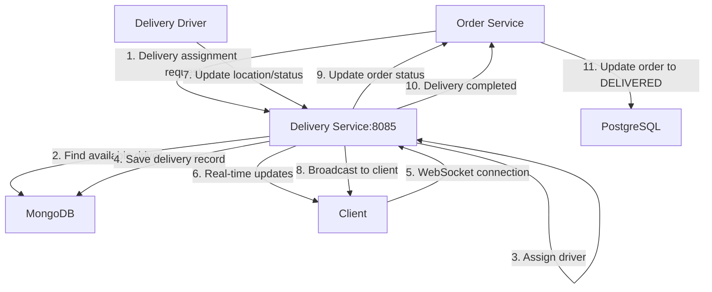
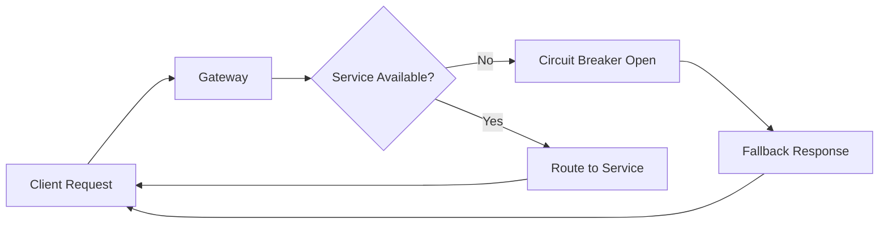
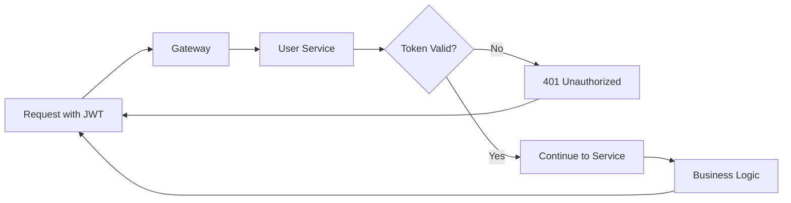
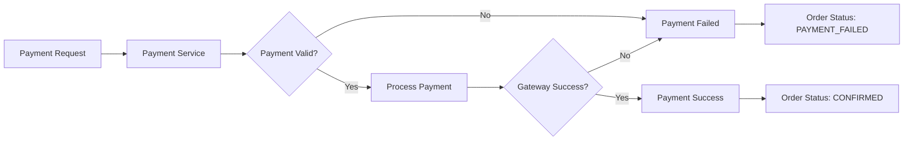

# 🔄 G10 Food Ordering System - Service Flow & Execution Guide

## 📋 Table of Contents
- [System Overview](#system-overview)
- [Service Responsibilities Matrix](#service-responsibilities-matrix)
- [Complete User Journey Flows](#complete-user-journey-flows)
- [Service Interaction Patterns](#service-interaction-patterns)
- [Data Flow Between Services](#data-flow-between-services)
- [Error Handling Flows](#error-handling-flows)
- [Development Testing Flow](#development-testing-flow)

---

## 🎯 System Overview

The G10 Food Ordering System operates through **6 main services** that work together to provide a complete food delivery experience. Each service has specific responsibilities and communicates with others through well-defined APIs.

### 🏗️ Quick Architecture View
```
Client → Gateway (8080) → [User|Catalog|Order|Payment|Delivery] Services
                              ↓       ↓      ↓       ↓        ↓
                          [MongoDB|MongoDB|PostgreSQL|PostgreSQL|MongoDB]
```

---

## 🎭 Service Responsibilities Matrix

| Service | Primary Role | Database | Key Actions | Dependencies |
|---------|-------------|----------|-------------|--------------|
| **Gateway (8080)** | Traffic Router | Redis Cache | Route requests, Load balance, Circuit breaker | None (Entry point) |
| **User Service (8081)** | Authentication | MongoDB | Register, Login, Profile management | None |
| **Catalog Service (8082)** | Restaurant Data | MongoDB | Restaurant CRUD, Menu management, Search | None |
| **Order Service (8083)** | Order Processing | PostgreSQL | Create orders, Status tracking, Order history | User Service (auth), Catalog Service (validation) |
| **Payment Service (8084)** | Payment Processing | PostgreSQL | Process payments, Handle refunds, Transaction logs | Order Service (payment requests) |
| **Delivery Service (8085)** | Delivery Logistics | MongoDB | Assign drivers, Track deliveries, Real-time updates | Order Service (delivery requests) |

---

## 🚶‍♂️ Complete User Journey Flows

### 1. 👤 User Registration & Authentication Flow


**What happens:**
1. Client sends registration/login request to Gateway
2. Gateway routes to User Service (8081)
3. User Service validates data and stores in MongoDB
4. JWT token is generated for authentication
5. Token returned to client for future requests

**Key Files:**
- `UserController.java` - Handles registration/login endpoints
- `JwtUtil.java` - Generates and validates JWT tokens
- `UserService.java` - Business logic for user operations

---

### 2. 🍽️ Restaurant Discovery Flow
```mermaid
graph LR
    A[Client] -->|1. GET /api/restaurants| B[Gateway:8080]
    B -->|2. Route| C[Catalog Service:8082]
    C -->|3. Query restaurants| D[MongoDB]
    D -->|4. Return restaurant list| C
    C -->|5. Apply filters/sorting| C
    C -->|6. Return formatted data| B
    B -->|7. Return to client| A
    
    A -->|8. GET /api/restaurants/{id}/menu| B
    B -->|9. Route| C
    C -->|10. Get menu items| D
    C -->|11. Return menu data| B
    B -->|12. Return to client| A
```

**What happens:**
1. Client browses restaurants (no authentication required)
2. Gateway routes to Catalog Service (8082)
3. Catalog Service queries MongoDB for restaurant data
4. Results are filtered, sorted, and returned
5. Client can view detailed menu for selected restaurant

**Key Files:**
- `RestaurantController.java` - Restaurant and menu endpoints
- `RestaurantService.java` - Business logic for restaurant operations
- `RestaurantRepository.java` - MongoDB data access

---

### 3. 📋 Order Creation Flow (The Complex One!)


**What happens:**
1. **Authentication**: Client sends JWT token, User Service validates
2. **Order Validation**: Order Service validates restaurant/menu items via Catalog Service
3. **Order Creation**: Order saved to PostgreSQL with auto-assigned user ID
4. **Payment Processing**: Payment Service processes payment via gRPC
5. **Delivery Assignment**: Delivery Service assigns driver to order
6. **Response**: Complete order details returned to client

**Key Files:**
- `OrderController.java` - Order creation and management
- `JwtUtil.java` - Token validation in Order Service
- `PaymentController.java` - Payment processing
- `DeliveryController.java` - Delivery assignment

---

### 4. 💳 Payment Processing Flow
```mermaid
graph TD
    A[Order Service] -->|1. gRPC Payment Request| B[Payment Service:8084]
    B -->|2. Validate payment data| B
    B -->|3. Process with payment gateway| C[External Payment Gateway]
    C -->|4. Payment response| B
    B -->|5. Save transaction| D[PostgreSQL]
    B -->|6. Return payment result| A
    
    A -->|7. Update order status| E[Order Database]
    
    F[Client] -->|8. GET /api/payments/status/{id}| G[Gateway]
    G -->|9. Route| B
    B -->|10. Get payment status| D
    B -->|11. Return status| F
```

**What happens:**
1. Order Service calls Payment Service via gRPC for better performance
2. Payment Service validates payment details
3. External payment gateway processes the transaction
4. Transaction details saved to PostgreSQL
5. Result returned to Order Service
6. Order status updated based on payment result

**Key Files:**
- `PaymentController.java` - Payment endpoints
- `PaymentService.java` - Payment business logic
- gRPC service definitions for inter-service communication

---

### 5. 🚚 Delivery Tracking Flow


**What happens:**
1. Order Service requests delivery assignment after payment confirmation
2. Delivery Service finds available driver and assigns delivery
3. Client connects via WebSocket for real-time tracking
4. Driver updates location/status through mobile app
5. Updates broadcast to client in real-time
6. Order status updated when delivery completed

**Key Files:**
- `DeliveryController.java` - Delivery management endpoints
- WebSocket configuration for real-time tracking
- `OrderController.java` - Status update handling

---

## 🔄 Service Interaction Patterns

### 1. Authentication Pattern (Used by all services)
```java
// Every protected endpoint does this:
1. Extract JWT token from Authorization header
2. Validate token using JwtUtil
3. Extract user ID and role from token
4. Check permissions for the operation
5. Proceed with business logic
```

### 2. Service-to-Service Communication
```yaml
Synchronous (REST):
  - Gateway → All Services (HTTP)
  - Order → Catalog (validation)
  - Client → Gateway (all requests)

Asynchronous (gRPC):
  - Order → Payment (high performance)

Real-time (WebSocket):
  - Client ↔ Delivery Service (tracking)
```

### 3. Database Access Patterns
```yaml
User Service:     MongoDB (NoSQL for user profiles)
Catalog Service:  MongoDB (NoSQL for restaurant data)
Order Service:    PostgreSQL (ACID for transactions)
Payment Service:  PostgreSQL (ACID for financial data)
Delivery Service: MongoDB (NoSQL for tracking data)
Gateway:          Redis (Caching and sessions)
```

---

## 📊 Data Flow Between Services

### Order Creation Data Flow
```
1. Client → Gateway: Order JSON + JWT
2. Gateway → User Service: JWT validation
3. Gateway → Order Service: Validated request
4. Order Service → Catalog Service: Validate items
5. Order Service → Payment Service: Process payment
6. Order Service → Delivery Service: Assign delivery
7. Order Service → Client: Complete order response
```

### Authentication Data Flow
```
1. Client → Gateway → User Service: Login credentials
2. User Service → MongoDB: Validate user
3. User Service → User Service: Generate JWT
4. User Service → Gateway → Client: JWT token
5. Client: Store JWT for future requests
```

### Real-time Tracking Data Flow
```
1. Client → Gateway → Delivery Service: WebSocket connection
2. Driver App → Delivery Service: Location updates
3. Delivery Service → Client: Real-time broadcast
4. Delivery Service → Order Service: Status updates
```

---

## 🚨 Error Handling Flows

### Service Unavailable Flow


### Authentication Failure Flow


### Payment Failure Flow


---

## 🧪 Development Testing Flow

### 1. Start Infrastructure Services
```bash
cd dev-infra
docker-compose up -d
# Starts: MongoDB, PostgreSQL, Redis, RabbitMQ
```

### 2. Start Application Services (in order)
```bash
# 1. User Service (authentication required first)
java -jar user-service/target/user-service-1.0.0.jar

# 2. Catalog Service (restaurant data)
java -jar catalog-service/target/catalog-service-1.0.0.jar

# 3. Payment Service (gRPC server)
java -jar payment-service/target/payment-service-1.0.0.jar

# 4. Order Service (depends on User, Catalog, Payment)
java -jar order-service/target/order-service-1.0.0.jar

# 5. Delivery Service (depends on Order events)
java -jar delivery-service/target/delivery-service-1.0.0.jar

# 6. Gateway (routes to all services)
java -jar gateway-service/target/gateway-service-1.0.0.jar
```

### 3. Testing with Bruno Collections
```bash
# Import service-specific collections:
testing/bruno-collections-by-service/
├── user-service/       # Authentication flow
├── catalog-service/    # Restaurant browsing
├── order-service/      # Order management
├── payment-service/    # Payment processing
└── delivery-service/   # Delivery tracking
```

### 4. Test Flow Example
```
1. User Service: Register → Login (get JWT token)
2. Catalog Service: Browse restaurants → Get menu
3. Order Service: Create order (uses JWT from step 1)
4. Payment Service: Payment automatically processed
5. Delivery Service: Track delivery status
```

---

## 🎯 Quick Service Verification

### Health Checks (verify all services are running)
```bash
curl http://localhost:8080/actuator/health  # Gateway
curl http://localhost:8081/api/users/health # User Service
curl http://localhost:8082/api/restaurants/health # Catalog Service
curl http://localhost:8083/api/orders/health # Order Service
curl http://localhost:8084/api/payments/health # Payment Service
curl http://localhost:8085/api/delivery/health # Delivery Service
```

### Service Dependencies Verification
```bash
# Check if databases are running
docker ps | grep mongo     # MongoDB (User, Catalog, Delivery)
docker ps | grep postgres  # PostgreSQL (Order, Payment)
docker ps | grep redis     # Redis (Gateway cache)
```

---

## 🔑 Key Takeaways for Team Members

### 1. **Authentication is Central**
- All protected operations require JWT token from User Service
- Token contains user ID and role information
- Each service validates tokens independently using JwtUtil

### 2. **Order Service is the Orchestrator**
- Coordinates with Catalog (validation), Payment (processing), and Delivery (assignment)
- Uses PostgreSQL for ACID transaction guarantees
- Implements CQRS pattern for read/write operations

### 3. **Gateway is the Single Entry Point**
- All client requests go through Gateway (port 8080)
- Implements circuit breakers and fallback mechanisms
- Handles CORS, rate limiting, and load balancing

### 4. **Database Strategy**
- NoSQL (MongoDB): User profiles, restaurant data, delivery tracking
- SQL (PostgreSQL): Orders and payments (financial data requiring ACID)
- Redis: Session management and caching

### 5. **Communication Patterns**
- REST API: Standard client-server communication
- gRPC: High-performance Payment Service communication
- WebSocket: Real-time delivery tracking

---

## 📚 Next Steps for New Team Members

1. **Set up local environment** using the infrastructure services
2. **Import Bruno collections** for each service to understand APIs
3. **Follow the complete user journey** from registration to order delivery
4. **Examine the code** for each service starting with controllers
5. **Test error scenarios** to understand fallback mechanisms

---

**Created**: November 21, 2025  
**Team**: G10 Food Ordering Development Team  
**Purpose**: Onboarding and flow understanding guide