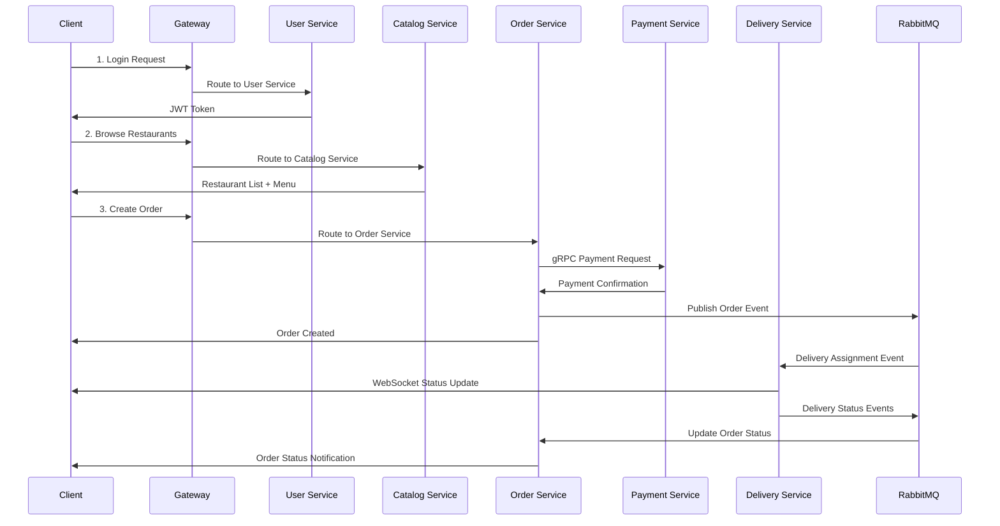
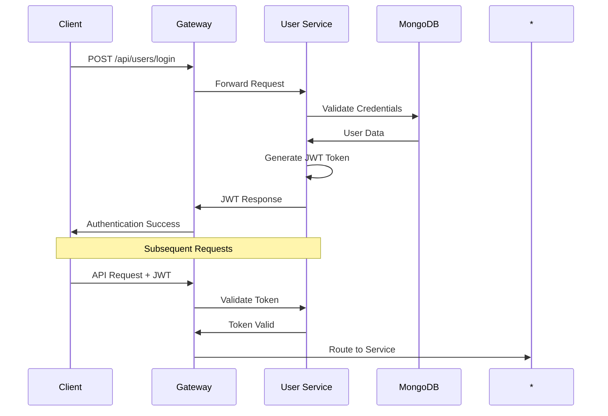

# 🏗️ G10 Food Ordering System - Architecture & Flow Guide

## 📋 Table of Contents
- [System Overview](#system-overview)
- [Microservices Architecture](#microservices-architecture)
- [Service Details](#service-details)
- [Data Flow Diagrams](#data-flow-diagrams)
- [API Gateway Flow](#api-gateway-flow)
- [Database Architecture](#database-architecture)
- [Authentication & Security](#authentication--security)
- [Inter-Service Communication](#inter-service-communication)
- [Complete User Journey](#complete-user-journey)
- [Error Handling](#error-handling)
- [Monitoring & Health Checks](#monitoring--health-checks)

---

## 🎯 System Overview

The G10 Food Ordering System is a **100% Spring Boot microservices architecture** designed for scalable food delivery operations. The system follows Domain-Driven Design (DDD) principles with clear service boundaries and responsibilities.

### 🏛️ Architecture Pattern
- **API Gateway Pattern**: Single entry point for all client requests
- **Database per Service**: Each service owns its data
- **Event-Driven Architecture**: Asynchronous communication via message queues
- **CQRS Pattern**: Command and Query Responsibility Segregation in Order Service
- **Circuit Breaker Pattern**: Fault tolerance and resilience

---

## 🚀 Microservices Architecture

```
┌─────────────────────────────────────────────────────────────────┐
│                        CLIENT APPLICATIONS                      │
│          (Web App, Mobile App, Admin Panel)                    │
└─────────────────────┬───────────────────────────────────────────┘
                      │
┌─────────────────────▼───────────────────────────────────────────┐
│                 🌐 SPRING CLOUD GATEWAY                        │
│                    (Port: 8080)                                │
│              • Routing & Load Balancing                        │
│              • Circuit Breakers                                │
│              • Rate Limiting                                   │
└─────────────┬───┬───┬───┬───┬─────────────────────────────────────┘
              │   │   │   │   │
    ┌─────────▼───▼───▼───▼───▼─────────────────────────────────────┐
    │                MICROSERVICES LAYER                          │
    │                                                             │
    │  👤 User      🍽️ Catalog    📋 Order      💳 Payment      🚚 Delivery │
    │  Service      Service       Service      Service       Service │
    │  (8081)       (8082)        (8083)       (8084)        (8085)  │
    │                                                             │
    │  MongoDB      MongoDB       PostgreSQL   gRPC Server    MongoDB │
    │  JWT Auth     Restaurant    JPA/CQRS     HPA Gateway    WebSocket│
    └─────────────────────────────────────────────────────────────────┘
                              │
    ┌─────────────────────────▼─────────────────────────────────────┐
    │                INFRASTRUCTURE LAYER                         │
    │                                                             │
    │  🗄️ MongoDB    🗄️ PostgreSQL   📨 RabbitMQ    📊 Redis        │
    │  (27017)       (5432)          (5672)        (6379)       │
    │                                                             │
    │  • User Data   • Orders        • Events      • Cache       │
    │  • Restaurants • Payments      • Queues      • Sessions    │
    │  • Deliveries  • Transactions                              │
    └─────────────────────────────────────────────────────────────────┘
```

---

## 🔧 Service Details

### 🌐 Gateway Service (Port: 8080)
**Technology**: Spring Cloud Gateway + Spring Boot 3.2.0
**Purpose**: API Gateway and traffic management

#### Responsibilities:
- ✅ **Request Routing**: Routes requests to appropriate microservices
- ✅ **Load Balancing**: Distributes traffic across service instances
- ✅ **Circuit Breakers**: Handles service failures gracefully
- ✅ **Rate Limiting**: Prevents API abuse
- ✅ **CORS Handling**: Cross-origin request management

#### Key Components:
```java
@Configuration
public class GatewayConfig {
    // Route definitions
    // Circuit breaker configurations
    // Fallback handlers
}
```

#### Route Configuration:
```yaml
/api/users/**     → user-service:8080      (User management)
/api/restaurants/** → catalog-service:8080  (Restaurant data)
/api/orders/**    → order-service:8080      (Order processing)
/api/payments/**  → payment-service:8080    (Payment handling)
/api/delivery/**  → delivery-service:8080   (Delivery tracking)
```

---

### 👤 User Service (Port: 8081)
**Technology**: Spring Boot + Spring Security + JWT + MongoDB
**Purpose**: User management and authentication

#### Responsibilities:
- ✅ **User Registration**: Create new customer accounts
- ✅ **Authentication**: JWT-based login system
- ✅ **Profile Management**: Update user information
- ✅ **Role Management**: Customer, Restaurant Owner, Delivery Partner
- ✅ **Security**: Password hashing with BCrypt

#### Database Schema (MongoDB):
```javascript
{
  _id: ObjectId,
  email: String,
  username: String,
  name: String,
  phone: String,
  role: "CUSTOMER" | "RESTAURANT_OWNER" | "DELIVERY_PARTNER",
  addresses: [AddressDto],
  preferences: UserPreferencesDto,
  createdAt: DateTime,
  updatedAt: DateTime,
  active: Boolean,
  emailVerified: Boolean
}
```

#### Key Endpoints:
- `POST /api/users/register` - User registration
- `POST /api/users/login` - User authentication
- `GET /api/users/profile` - Get user profile
- `PUT /api/users/profile` - Update profile
- `POST /api/users/logout` - User logout

#### Security Flow:
```
User Login → Password Validation → JWT Generation → Token Response
         ↓
JWT Token → Request Authorization → Token Validation → Access Granted
```

---

### 🍽️ Catalog Service (Port: 8082)
**Technology**: Spring Boot + Spring Data MongoDB
**Purpose**: Restaurant and menu management

#### Responsibilities:
- ✅ **Restaurant Management**: CRUD operations for restaurants
- ✅ **Menu Management**: Food items, pricing, availability
- ✅ **Search & Filtering**: Restaurant discovery by cuisine, location
- ✅ **Business Hours**: Operating times and availability

#### Database Schema (MongoDB):
```javascript
// Restaurant Document
{
  _id: ObjectId,
  name: String,
  cuisineType: String,
  address: {
    street: String,
    city: String,
    state: String,
    zipCode: String,
    country: String
  },
  phone: String,
  email: String,
  isActive: Boolean,
  rating: Number,
  deliveryTime: Number,
  minimumOrder: Number,
  createdAt: DateTime,
  updatedAt: DateTime
}

// Menu Item Document
{
  _id: ObjectId,
  restaurantId: ObjectId,
  name: String,
  description: String,
  price: Number,
  category: String,
  isVegetarian: Boolean,
  isAvailable: Boolean,
  ingredients: [String],
  allergens: [String]
}
```

#### Key Endpoints:
- `GET /api/restaurants` - List all restaurants
- `POST /api/restaurants` - Create new restaurant
- `GET /api/restaurants/{id}` - Get restaurant details
- `GET /api/restaurants/{id}/menu` - Get restaurant menu
- `POST /api/restaurants/{id}/menu` - Add menu item

---

### 📋 Order Service (Port: 8083)
**Technology**: Spring Boot + Spring Data JPA + PostgreSQL + CQRS
**Purpose**: Order processing and management

#### Responsibilities:
- ✅ **Order Creation**: Process new food orders
- ✅ **Order Tracking**: Status updates and history
- ✅ **CQRS Implementation**: Separate read/write models
- ✅ **Order Validation**: Business rules and constraints
- ✅ **Integration**: Connects with Payment and Delivery services

#### Database Schema (PostgreSQL):
```sql
-- Orders Table
CREATE TABLE orders (
    id BIGSERIAL PRIMARY KEY,
    user_id VARCHAR(255) NOT NULL,
    restaurant_id VARCHAR(255) NOT NULL,
    status VARCHAR(50) NOT NULL,
    total_amount DECIMAL(10,2) NOT NULL,
    delivery_address TEXT NOT NULL,
    special_instructions TEXT,
    created_at TIMESTAMP DEFAULT CURRENT_TIMESTAMP,
    updated_at TIMESTAMP DEFAULT CURRENT_TIMESTAMP
);

-- Order Items Table
CREATE TABLE order_items (
    id BIGSERIAL PRIMARY KEY,
    order_id BIGINT REFERENCES orders(id),
    menu_item_id VARCHAR(255) NOT NULL,
    quantity INTEGER NOT NULL,
    unit_price DECIMAL(10,2) NOT NULL,
    subtotal DECIMAL(10,2) NOT NULL
);
```

#### Order Status Flow:
```
PENDING → CONFIRMED → PREPARING → READY → OUT_FOR_DELIVERY → DELIVERED
   ↓         ↓           ↓         ↓            ↓              ↓
Events   Payment     Kitchen    Ready      Delivery        Complete
```

#### Key Endpoints:
- `POST /api/orders` - Create new order
- `GET /api/orders/{id}` - Get order details
- `PUT /api/orders/{id}/status` - Update order status
- `GET /api/orders/user/{userId}` - Get user's orders

---

### 💳 Payment Service (Port: 8084)
**Technology**: Spring Boot + gRPC + PostgreSQL
**Purpose**: Payment processing and transaction management

#### Responsibilities:
- ✅ **Payment Processing**: Handle payment transactions
- ✅ **gRPC Communication**: High-performance inter-service calls
- ✅ **Transaction Management**: ACID compliance
- ✅ **Payment Methods**: Credit/Debit cards, Digital wallets
- ✅ **Refund Handling**: Process order cancellations

#### Database Schema (PostgreSQL):
```sql
-- Payments Table
CREATE TABLE payments (
    id BIGSERIAL PRIMARY KEY,
    order_id BIGINT NOT NULL,
    user_id VARCHAR(255) NOT NULL,
    amount DECIMAL(10,2) NOT NULL,
    payment_method VARCHAR(50) NOT NULL,
    status VARCHAR(30) NOT NULL,
    transaction_id VARCHAR(255) UNIQUE,
    gateway_response TEXT,
    created_at TIMESTAMP DEFAULT CURRENT_TIMESTAMP,
    updated_at TIMESTAMP DEFAULT CURRENT_TIMESTAMP
);
```

#### Payment Flow:
```
Order Created → Payment Request → Gateway Processing → Payment Confirmation
     ↓               ↓                    ↓                    ↓
  gRPC Call    Validation Check    External Gateway    Database Update
```

#### Key Endpoints:
- `POST /api/payments/process` - Process payment
- `GET /api/payments/{id}` - Get payment details
- `POST /api/payments/{id}/refund` - Process refund

#### gRPC Service:
```protobuf
service PaymentService {
  rpc ProcessPayment(PaymentRequest) returns (PaymentResponse);
  rpc GetPaymentStatus(PaymentStatusRequest) returns (PaymentStatusResponse);
}
```

---

### 🚚 Delivery Service (Port: 8085)
**Technology**: Spring Boot + WebSocket + MongoDB + RabbitMQ
**Purpose**: Delivery tracking and logistics

#### Responsibilities:
- ✅ **Delivery Assignment**: Match orders with delivery partners
- ✅ **Real-time Tracking**: WebSocket-based location updates
- ✅ **Route Optimization**: Efficient delivery routing
- ✅ **Status Updates**: Live delivery status notifications
- ✅ **Delivery History**: Track completed deliveries

#### Database Schema (MongoDB):
```javascript
{
  _id: ObjectId,
  orderId: String,
  deliveryPartnerId: String,
  customerAddress: String,
  restaurantAddress: String,
  status: "ASSIGNED" | "PICKED_UP" | "IN_TRANSIT" | "DELIVERED",
  estimatedTime: Number,
  actualTime: Number,
  route: [GeoPoint],
  createdAt: DateTime,
  updatedAt: DateTime
}
```

#### WebSocket Communication:
```javascript
// Client connects to WebSocket
/ws/delivery/{deliveryId}

// Real-time updates
{
  "deliveryId": "123",
  "status": "IN_TRANSIT",
  "location": { "lat": 40.7128, "lng": -74.0060 },
  "estimatedTime": 15
}
```

#### Key Endpoints:
- `POST /api/delivery/assign` - Assign delivery partner
- `GET /api/delivery/{id}/track` - Track delivery
- `PUT /api/delivery/{id}/status` - Update delivery status
- `GET /ws/delivery/{id}` - WebSocket connection for real-time updates

---

## 📊 Data Flow Diagrams

### 🔄 Complete Order Flow



### 🔐 Authentication Flow



---

## 🗄️ Database Architecture

### Database per Service Pattern

```
┌─────────────────┐    ┌─────────────────┐    ┌─────────────────┐
│   User Service  │    │ Catalog Service │    │Delivery Service │
│                 │    │                 │    │                 │
│   MongoDB       │    │   MongoDB       │    │   MongoDB       │
│   • users       │    │   • restaurants │    │   • deliveries  │
│   • preferences │    │   • menu_items  │    │   • routes      │
└─────────────────┘    └─────────────────┘    └─────────────────┘

┌─────────────────┐    ┌─────────────────┐    ┌─────────────────┐
│  Order Service  │    │ Payment Service │    │   Gateway       │
│                 │    │                 │    │                 │
│  PostgreSQL     │    │  PostgreSQL     │    │   Redis         │
│  • orders       │    │  • payments     │    │   • sessions    │
│  • order_items  │    │  • transactions │    │   • cache       │
└─────────────────┘    └─────────────────┘    └─────────────────┘
```

### Data Consistency Strategy

- **Eventual Consistency**: Between services via events
- **Strong Consistency**: Within service boundaries
- **Saga Pattern**: For distributed transactions
- **Event Sourcing**: Order state changes

---

## 🔒 Authentication & Security

### JWT Security Implementation

```java
@Component
public class JwtAuthenticationFilter extends OncePerRequestFilter {
    // Token validation
    // Security context setup
    // Request filtering
}
```

### Security Configuration

```yaml
# Protected Endpoints
/api/users/profile    → JWT Required
/api/orders/**        → JWT Required
/api/payments/**      → JWT Required
/api/delivery/**      → JWT Required

# Public Endpoints
/api/users/register   → Public
/api/users/login      → Public
/api/restaurants      → Public (read-only)
/actuator/health      → Public
```

### Role-Based Access Control

- **CUSTOMER**: Order food, manage profile
- **RESTAURANT_OWNER**: Manage restaurant and menu
- **DELIVERY_PARTNER**: Accept and fulfill deliveries
- **ADMIN**: System administration

---

## 📡 Inter-Service Communication

### Communication Patterns

1. **Synchronous**: HTTP REST APIs via Gateway
2. **Asynchronous**: RabbitMQ message queues
3. **High-Performance**: gRPC for Payment Service
4. **Real-time**: WebSocket for Delivery tracking

### Message Queue Events

```yaml
Order Events:
  - order.created
  - order.confirmed
  - order.cancelled
  - order.completed

Payment Events:
  - payment.processed
  - payment.failed
  - payment.refunded

Delivery Events:
  - delivery.assigned
  - delivery.picked_up
  - delivery.in_transit
  - delivery.delivered
```

---

## 🎯 Complete User Journey

### 1. User Registration & Login
```
1. User visits application
2. Registers with email/password
3. Receives JWT token
4. Token stored for future requests
```

### 2. Restaurant Discovery
```
1. Browse restaurants (Public API)
2. Filter by cuisine, location, rating
3. View menu and prices
4. Select items for order
```

### 3. Order Placement
```
1. Create order with selected items
2. Provide delivery address
3. Process payment via Payment Service
4. Order confirmation and tracking ID
```

### 4. Order Processing
```
1. Restaurant receives order notification
2. Order status: CONFIRMED → PREPARING
3. Kitchen prepares food
4. Status update: READY
```

### 5. Delivery Assignment
```
1. Delivery Service assigns partner
2. Partner accepts delivery
3. Real-time tracking begins
4. Customer receives live updates
```

### 6. Order Fulfillment
```
1. Partner picks up from restaurant
2. Status: OUT_FOR_DELIVERY
3. Real-time location tracking
4. Delivery confirmation: DELIVERED
```

---

## 🚨 Error Handling

### Circuit Breaker Pattern
```java
@Component
public class OrderServiceFallback {
    public ResponseEntity<?> fallbackMethod() {
        return ResponseEntity.ok("Service temporarily unavailable");
    }
}
```

### Error Response Format
```json
{
  "success": false,
  "message": "Service unavailable",
  "error": "CIRCUIT_BREAKER_OPEN",
  "timestamp": "2025-11-21T12:00:00Z",
  "path": "/api/orders",
  "status": 503
}
```

### Retry Mechanisms
- **Exponential Backoff**: For transient failures
- **Circuit Breakers**: Prevent cascade failures
- **Bulkhead Pattern**: Isolate critical resources

---

## 📊 Monitoring & Health Checks

### Spring Boot Actuator Endpoints
```yaml
/actuator/health     → Service health status
/actuator/metrics    → Application metrics
/actuator/info       → Service information
/actuator/prometheus → Prometheus metrics
```

### Health Check Response
```json
{
  "status": "UP",
  "components": {
    "db": { "status": "UP" },
    "rabbit": { "status": "UP" },
    "diskSpace": { "status": "UP" }
  }
}
```

### Service Dependencies
```
Gateway (8080)     → All services healthy
User Service       → MongoDB connection
Catalog Service    → MongoDB connection
Order Service      → PostgreSQL + RabbitMQ
Payment Service    → PostgreSQL + gRPC
Delivery Service   → MongoDB + RabbitMQ + WebSocket
```

---

## 🔧 Development & Deployment

### Environment Configuration
```yaml
Local Development:
  - Docker Compose for infrastructure
  - Port mapping: 8080-8085
  - Hot reloading enabled

Production:
  - Kubernetes deployment
  - Load balancers
  - Auto-scaling
  - Health checks
```

### Service Startup Order
```
1. Infrastructure (MongoDB, PostgreSQL, Redis, RabbitMQ)
2. User Service (Authentication required first)
3. Catalog Service (Restaurant data)
4. Payment Service (gRPC server)
5. Order Service (Depends on Payment)
6. Delivery Service (Depends on Order events)
7. Gateway (Routes to all services)
```

---

## 🎉 Conclusion

The G10 Food Ordering System implements a robust, scalable microservices architecture with:

- ✅ **Clear Service Boundaries**: Each service has a single responsibility
- ✅ **Technology Diversity**: Right tool for each job
- ✅ **Fault Tolerance**: Circuit breakers and fallback mechanisms
- ✅ **Real-time Features**: WebSocket delivery tracking
- ✅ **Security**: JWT-based authentication throughout
- ✅ **Monitoring**: Comprehensive health checks and metrics

This architecture supports high scalability, maintainability, and team autonomy while ensuring reliable food delivery operations.

---

## 📚 Additional Resources

- [Bruno API Testing Guide](./testing/BRUNO-TESTING-GUIDE.md)
- [Service Deployment Guide](./DEPLOYMENT-GUIDE.md)
- [API Documentation](./swagger/api-docs.md)
- [Database Schema Reference](./database/schema-reference.md)

**Last Updated**: November 21, 2025
**Version**: 1.0.0
**Team**: G10 Food Ordering Development Team